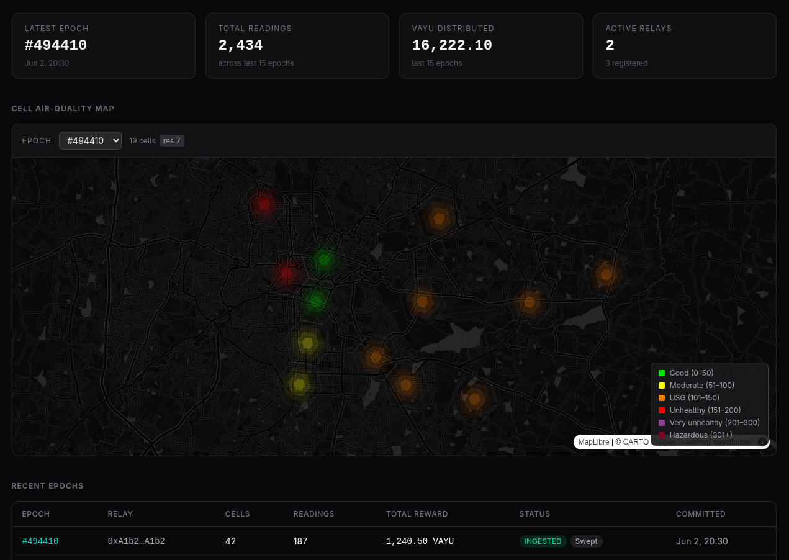
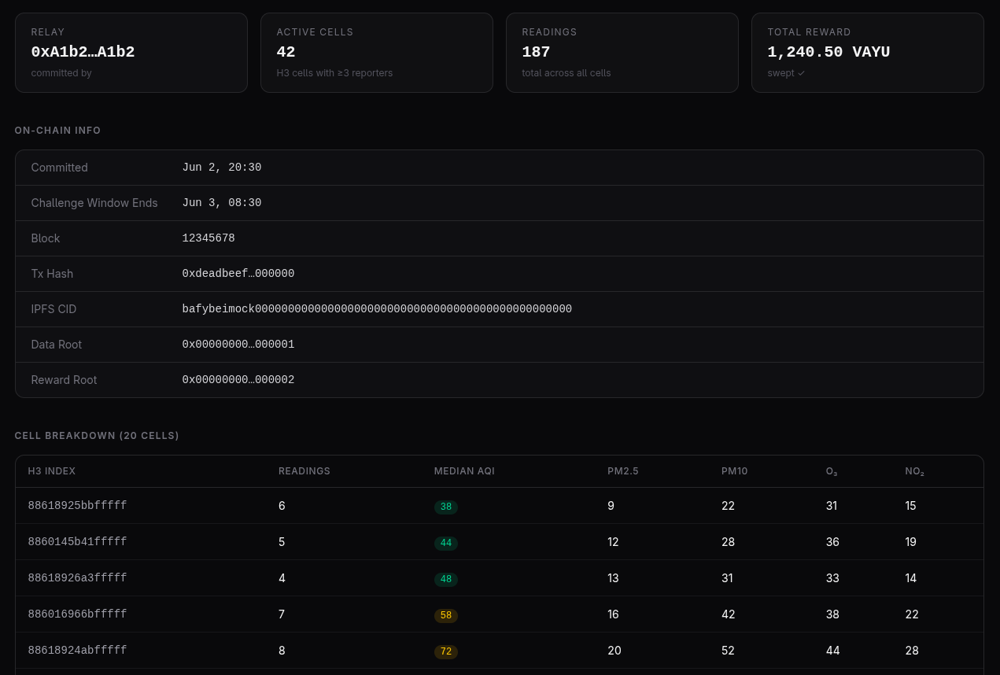

# Vayu Protocol

<p align="center">
   
</p>

<p align="center">
  <a href="https://github.com/dev-vim/vayu-protocol-stack/blob/main/LICENSE"></a>
  <a href="https://github.com/dev-vim/vayu-protocol-stack/commits"></a>
  <a href="https://github.com/dev-vim/vayu-protocol-stack/issues"></a>
  <a href="https://github.com/dev-vim/vayu-protocol-stack/actions/workflows/ci.yml"></a>
  
  
  
  
</p>

Vayu is a [DePIN](https://en.wikipedia.org/wiki/Decentralized_physical_infrastructure_network) stack for air quality monitoring. Edge devices submit cryptographically-signed AQI sensor readings to a relay, which aggregates them per-epoch, pins a data blob to IPFS, and commits a settlement transaction on-chain. A Ponder indexer watches the chain events and exposes a GraphQL API; a Next.js dashboard renders the indexed data.

## Motivation

Air quality data today is produced and controlled by centralised agencies - you must accept their figures as ground truth with no independent way to verify or dispute them. This is a single point of failure that can be easily weaponised - there is no audit trail, no way to prove tampering, and no alternative source to appeal to.

DePIN offers a *trustless* alternative: anyone can run a sensor, all readings are cryptographically signed by the submitting device, and the aggregate truth is committed on-chain - no central authority decides what the air quality was.

Vayu implements this model as a complete stack - Reporters stake VAYU tokens to participate and submit EIP-712 signed readings each epoch. The relay service validates, aggregates, and scores each reading against cell medians, builds Merkle reward allocations, pins the epoch blob to IPFS, and settles on-chain. Reporters claim rewards trustlessly with Merkle proofs.

## Screenshots

> _Run `docker compose up --build` and open [http://localhost:3000](http://localhost:3000) to see the dashboard live._





## Highlights

- **EIP-712 structured-data signing** - all reporter readings are EIP-712 typed-data signed; the relay verifies signatures before accepting and the settlement contract anchors the aggregate data root on-chain
- **Optimistic reward proofs** - the relay computes reward allocations off-chain and commits them as a Merkle root; because the raw readings are pinned to IPFS, anyone can re-derive the expected roots and raise a fisherman challenge if they diverge - reporters then claim independently with on-chain Merkle inclusion proofs
- **On-chain settlement in Solidity** - staking, slashing, per-epoch Merkle settlement, and a fisherman challenge mechanism tested with Foundry invariant tests on the core contract
- **Resilient relay ingestion** - Resilience4j circuit breaker + Caffeine TTL cache on the stake RPC; ingestion degrades gracefully during node outages rather than rejecting all submissions
- **Dual-process indexer** - Ponder indexes on-chain events; a separate IPFS sidecar hydrates off-chain blob data into the same PostgreSQL schema, each with independent failure domains
- **Cross-stack test coverage** - Foundry invariant tests, Vitest for the indexer (6 test files), and Spring MockMvc integration tests that sign requests live with a test EIP-712 signer using Anvil deterministic keys

## Stack Overview

```
                          ┌─────────────────────────────────────────┐
                          │  Edge Device                            │
                          │  Submits signed AQI readings (EIP-712)  │
                          └───────────────────┬─────────────────────┘
                                              │  write path
                                              ▼
                          ┌─────────────────────────────────────────┐
                          │  Relay  (Spring Boot)                   │
                          │  Validates, buffers, aggregates reads;  │
                          │  pins epoch blob to IPFS; commit epoch  │
                          └──────────┬──────────────────┬───────────┘
                           pin blob  │                  │  commit epoch
                                     ▼                  ▼
                          ┌─────────────────┐  ┌────────────────────┐
                          │  IPFS           │  │  EVM Chain         │
                          │  Stores epoch   │  │  Settlement,       │
                          │  JSON blobs     │  │  rewards & token   │
                          └────────┬────────┘  └─────────┬──────────┘
                          fetch    │                     │  read path
                          blob     ▼                     ▼
                          ┌─────────────────┐  ┌────────────────────┐
                          │  IPFS Sidecar   │  │  Ponder Indexer    │
                          │  (tsx)          │  │  (Ponder)          │
                          │  Hydrates per-  │  │  Indexes events;   │
                          │  cell rows      │  │  serves GraphQL    │
                          └────────┬────────┘  └─────────┬──────────┘
                                   │  write              │  write
                                   └──────────┬──────────┘
                                              ▼
                                   ┌────────────────────┐
                                   │  PostgreSQL        │
                                   │  Indexed epochs,   │
                                   │  readings & cells  │
                                   └──────────┬─────────┘
                                              │  GraphQL
                                              ▼
                                   ┌────────────────────┐
                                   │  Dashboard         │
                                   │  (Next.js)         │
                                   │  Renders epochs,   │
                                   │  reporters, stats  │
                                   └────────────────────┘
```


Component-level documentation is linked at the bottom of this file.

## Protocol Design

Each epoch proceeds in five steps:

1. **Ingestion** - Edge devices submit EIP-712 signed `AQIReading` structs to the relay. The relay validates the signature, checks on-chain stake (with circuit-breaker fallback), enforces a replay key per `(reporter, epochId, h3Cell)` to prevent duplicates, and buffers the reading in memory.

2. **Aggregation** - When the epoch window closes, the relay scores each reporter’s readings against the cell median AQI. Readings within the tolerance band earn a score of `1.0`; outliers are penalised. The epoch budget (~685 VAYU by default) is distributed pro-rata by score across active cells and reporters.

3. **Settlement** - The relay builds two Merkle trees: a *data root* over all raw readings and a *reward root* over `(reporter, h3IndexLong, amount)` leaves. The full epoch JSON blob is pinned to IPFS for transparency, and `VayuEpochSettlement.commitEpoch()` stores both roots and the IPFS CID on-chain.

4. **Indexing** - Ponder picks up the `EpochCommitted` event and writes a row to PostgreSQL. The IPFS sidecar polls for `PENDING` epochs, fetches the blob, validates it against a Zod schema, and hydrates the `cell_epochs` and `readings` tables for analytics.

5. **Claiming** - Reporters call `VayuEpochSettlement.claimReward()` with a Merkle proof. The contract verifies the proof against the stored reward root and transfers VAYU from the `VayuRewards` escrow.

## Token Economics

**Supply and emission.** The protocol allocates 60 million VAYU to an immutable, non-upgradeable `VayuRewards` escrow. It releases a fixed budget of ~685 VAYU per epoch, distributed evenly across 87,600 epochs (10 years at one epoch per hour). The emission schedule is a protocol guarantee - the escrow contract has no owner and cannot be paused or adjusted.

**Participation requirements.** Reporters must stake a minimum of 100 VAYU; relays must stake a minimum of 10,000 VAYU. Both are subject to unbonding cooldowns (7 days for reporters, 14 days for relays) to prevent stake-and-exit before a challenge window closes.

**Epoch reward distribution.** The relay takes a 2% fee from each epoch budget (~14 VAYU). The remaining ~671 VAYU is distributed pro-rata across reporters whose readings fall within the cell median tolerance band. A cell must have at least 3 independent reporters to qualify for rewards; cells with fewer readings receive nothing, preventing single-device cells from extracting rewards uncontested.

**Slashing.** Stake is at risk from multiple vectors:

| Offence | Subject | Slash rate |
|---|---|---|
| 10 consecutive zero-score epochs | Reporter | 5% |
| Spatial anomaly (fisherman challenge) | Reporter | 20% |
| Duplicate location in same epoch | Reporter | 50% |
| Reward computation fraud | Relay | 30% |
| Penalty list fraud | Relay | 30% |
| Data integrity failure | Relay | 30% |
| Censorship | Relay | 20% |

**Fisherman incentive.** Half of every slash goes to the address that raised the successful challenge; the rest goes to the protocol treasury. This creates a direct economic incentive for third parties to monitor epoch commitments and submit challenges.

**Claim expiry.** Reporters have 90 days after an epoch is committed to claim their rewards (with the first 12 hours reserved for the fisherman challenge window). Unclaimed balances are swept to the treasury, recycling value back into the protocol.

## Architecture Decisions

**Relay scoped to write path only.** The relay accepts readings and commits epochs - nothing else. All query endpoints live on the Ponder indexer. This limits the relay’s attack surface and decouples the two layers so they can scale and be upgraded independently.

**IPFS sidecar as a separate process.** Ponder is optimised for on-chain event indexing. Fetching IPFS blobs, validating them against a schema, and writing relational rows has different failure modes and retry semantics. Running the sidecar as a separate process keeps both components simple and lets the sidecar fail and retry without disrupting Ponder’s chain sync.

**Resilience4j circuit breaker on the stake RPC.** Checking on-chain stake for every submission creates a synchronous RPC dependency on the ingestion hot path. A sliding-window circuit breaker, a Caffeine TTL primary cache, and an unbounded stale-value secondary cache mean a transient outage degrades to weight-1 participation rather than rejecting all readings.

**Deterministic contract addresses via nonce-0 deployment.** Anvil’s default signer starts at nonce 0, so all contract addresses are fixed and hardcoded in the Compose environment - no deployment artifact files need to be shared between containers at runtime (acceptable for local deployments).


## Local Deployment

### Prerequisites

- **Docker Engine 24+** (or Docker Desktop) with the Compose v2 plugin (`docker compose`)
- **4 GB+ RAM** available to Docker
- No other local dependencies - everything runs inside containers


| Service | Technology | Port(s) |
|---|---|---|
| `anvil` | Local EVM (Foundry) | 8545 |
| `postgres` | PostgreSQL 15 | 5432 |
| `ipfs` | Kubo (IPFS) | 5001 (API), 8081 (HTTP gateway) |
| `contracts` | Forge deploy (one-shot) | - |
| `relay` | Spring Boot 3 / Java 21 | 8080 |
| `ponder` | Ponder 0.16 / Node 22 | 42069 |
| `sidecar` | IPFS blob fetcher (tsx) | - |
| `dashboard` | Next.js 15 / React 19 | 3000 |
| `prometheus` | Prometheus | 9090 |

---

#### 1. Start the full stack

```bash
docker compose up --build
```

The first run builds the relay (Maven), indexer, and dashboard images. Subsequent starts reuse the cache and are significantly faster.

#### 2. Startup sequence

Services come up in dependency order. The full stack is ready in roughly 2–3 minutes:

1. **anvil** - EVM chain starts and begins producing blocks on demand
2. **postgres** - database initialised with `vayu_indexer` schema
3. **ipfs** - Kubo node starts, API listening on port 5001
4. **contracts** - Forge deploys `VayuRewards`, `VayuToken`, `VayuEpochSettlement`, `VayuFaucet` then exits (`code 0`)
5. **relay** - Spring Boot starts, connects to Anvil and IPFS
6. **ponder** - begins syncing chain events from block 1, GraphQL API becomes available
7. **sidecar** - polls Ponder's database for new epoch commits, fetches blobs from IPFS
8. **dashboard** - Next.js production server starts

#### 3. Confirm everything is up

```bash
docker compose ps
```

All services should show `running` (or `exited (0)` for the one-shot `contracts` service). You can also spot-check individual services:

```bash
# Relay health
curl -s http://localhost:8080/v1/health | jq .

# Ponder GraphQL liveness
curl -s http://localhost:42069/hello

# Dashboard
open http://localhost:3000   # or visit in a browser
```

---

### Testing the Stack

#### Submit readings

The Compose stack enables EIP-712 signature verification by default. Use the reporter
simulator to generate and submit properly signed readings:

```bash
cd reporter-simulator
pip install -r requirements.txt
python simulate.py
```

See [reporter-simulator/README.md](reporter-simulator/README.md) for all options including
multi-round simulation and tamper testing.

#### Watch the relay commit

The relay accumulates readings during each 60-second epoch window and commits at the
boundary. Follow the relay logs:

```bash
docker compose logs relay -f
```

Look for log lines referencing `commitEpoch` and an IPFS CID.

#### View the dashboard

Open [http://localhost:3000](http://localhost:3000). Once at least one epoch has been
committed and indexed, the dashboard renders epoch history, reporter activity, and relay
statistics.

See the component READMEs below for full API details, GraphQL queries, and on-chain
verification commands.

### Stop the stack (preserve data)

```bash
docker compose down
```

PostgreSQL and IPFS volumes are preserved. The Anvil chain has no persistent volume - on the next `up`, the `contracts` service redeploys to the same deterministic addresses (nonce-0 deployments using the default Anvil private key).

### Stop and wipe all data

```bash
docker compose down -v
```

This removes `postgres_data` and `ipfs_data` volumes. Use this to start completely fresh.

### Follow logs

```bash
docker compose logs -f                    # all services
docker compose logs -f relay              # relay only
docker compose logs -f ponder sidecar     # indexer pipeline
```

### Rebuild after code changes

```bash
docker compose up --build
```

Only the images whose build context changed will be rebuilt.

## Dev Notes

- **Private keys** - The default Anvil mnemonic key (`0xac0974bec3...`) is used for both contract deployment and the relay's on-chain signer. This is intentional for local dev and **must never be used in production**.
- **Epoch duration** - Set to 60 seconds in the Compose stack (`RELAY_EPOCH_DURATION_SECONDS=60`). Production uses 3600 seconds (1 hour).
- **Signature verification** - Enabled in the Compose stack (`RELAY_SECURITY_SIGNATURE_VERIFICATION_ENABLED=true`). Use the [reporter simulator](reporter-simulator/README.md) to generate properly signed readings. Set to `false` in compose for quick manual testing with unsigned payloads.
- **Stake checking** - Disabled by default. Reporter addresses in test readings do not need an on-chain stake balance.
- **Contract addresses** - Deterministic because Anvil starts at nonce 0 and the deployer key is fixed. The addresses are hardcoded in the Compose environment:
  - `VayuRewards` → `0x5FbDB2315678afecb367f032d93F642f64180aa3`
  - `VayuToken` → `0xe7f1725E7734CE288F8367e1Bb143E90bb3F0512`
  - `VayuEpochSettlement` → `0x9fE46736679d2D9a65F0992F2272dE9f3c7fa6e0`
  - `VayuFaucet` → `0xCf7Ed3AccA5a467e9e704C703E8D87F634fB0Fc9`

## Component Documentation

- [contracts/README.md](contracts/README.md) - Foundry project, contract descriptions, deployment
- [relay/README.md](relay/README.md) - Spring Boot relay, API reference, configuration
- [indexer/README.md](indexer/README.md) - Ponder indexer, GraphQL schema, sidecar
- [dashboard/README.md](dashboard/README.md) - Next.js dashboard, environment variables
- [reporter-simulator/README.md](reporter-simulator/README.md) - EIP-712 signing simulator for local testing
