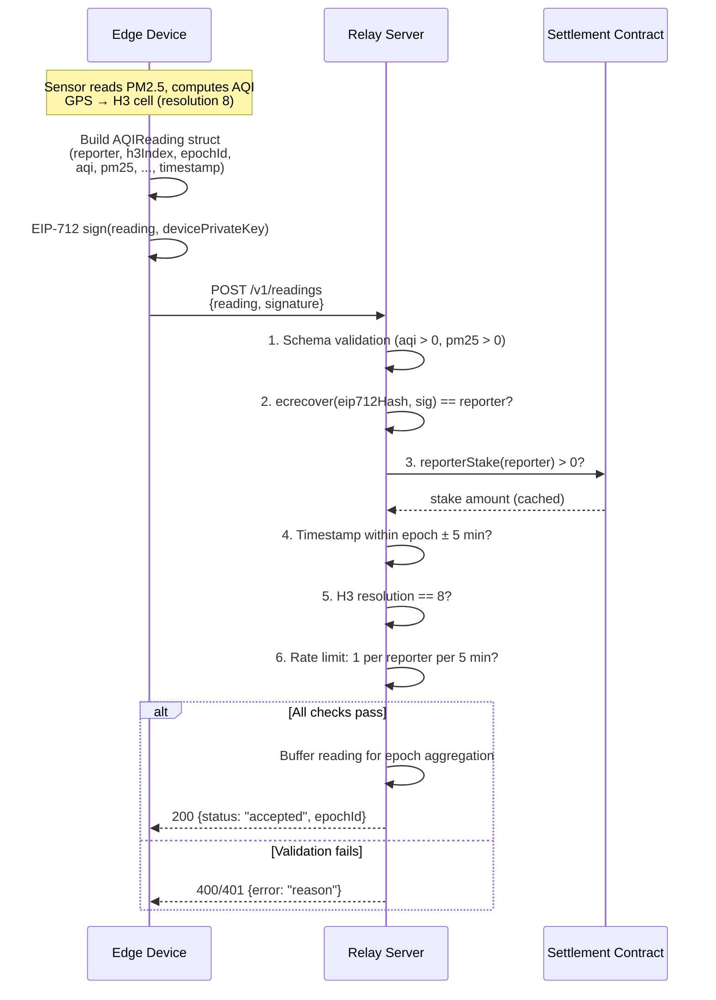
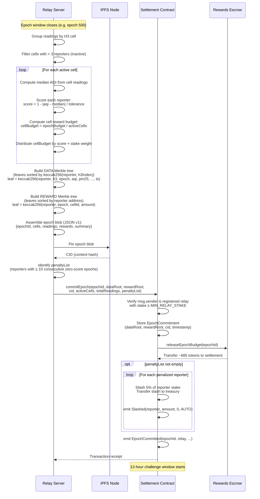
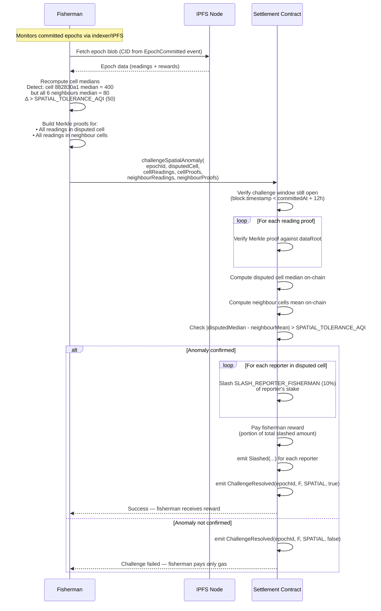
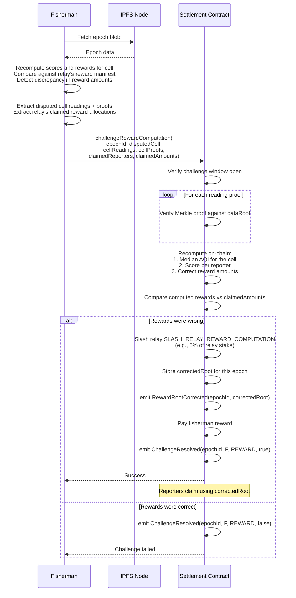
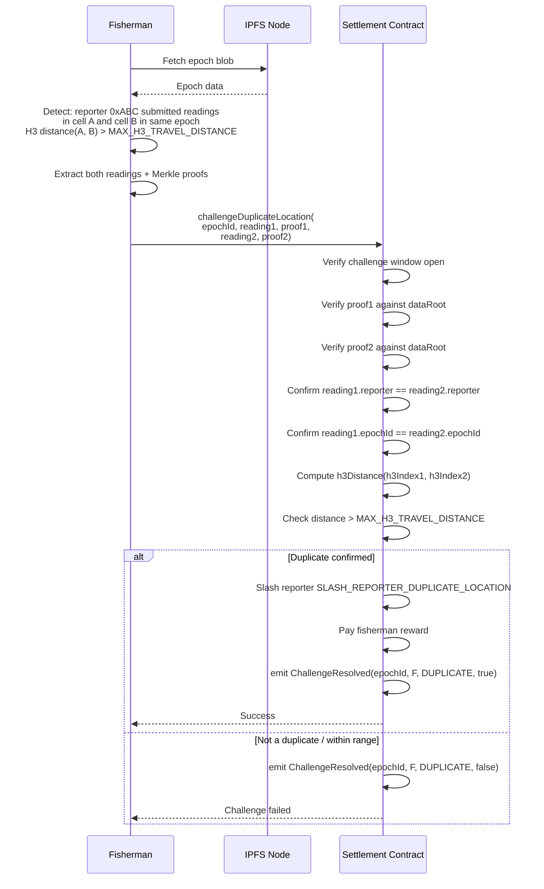
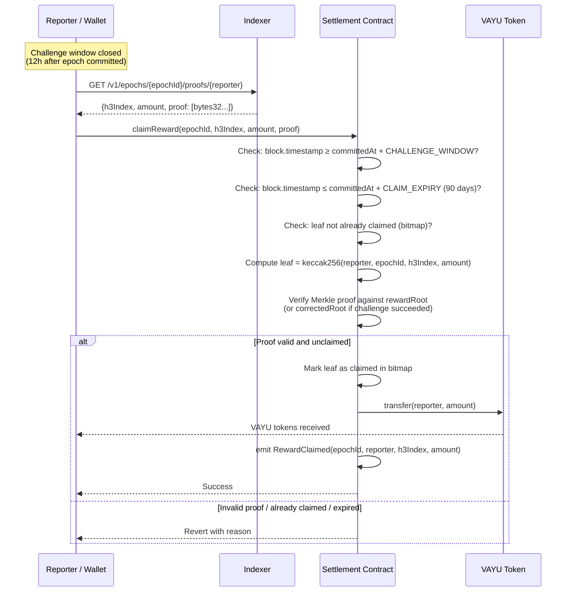
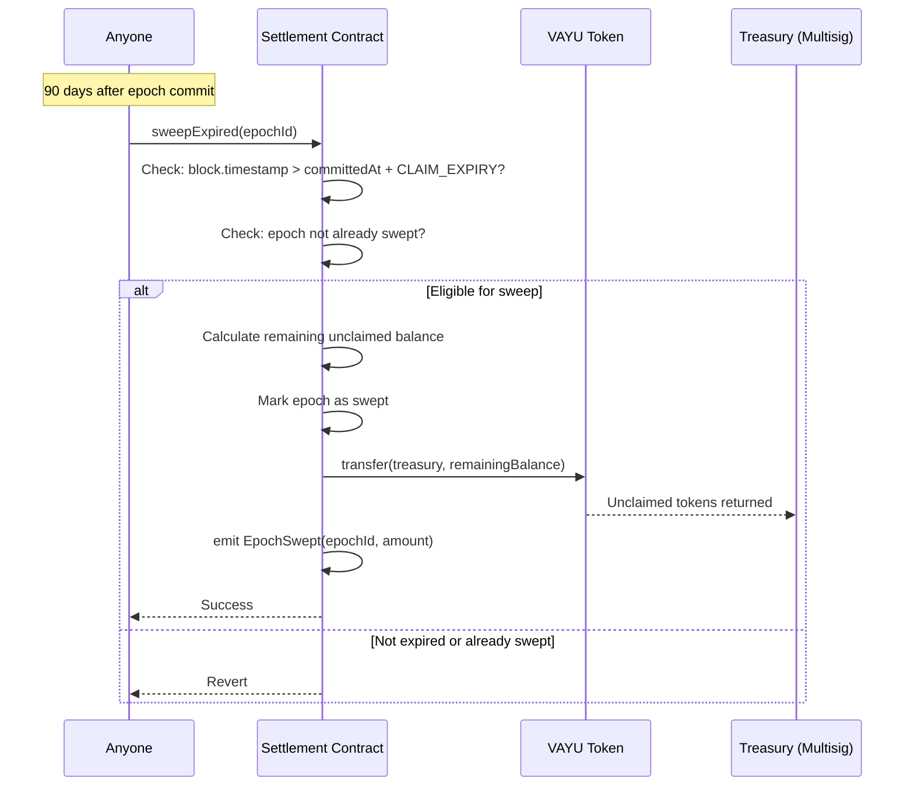
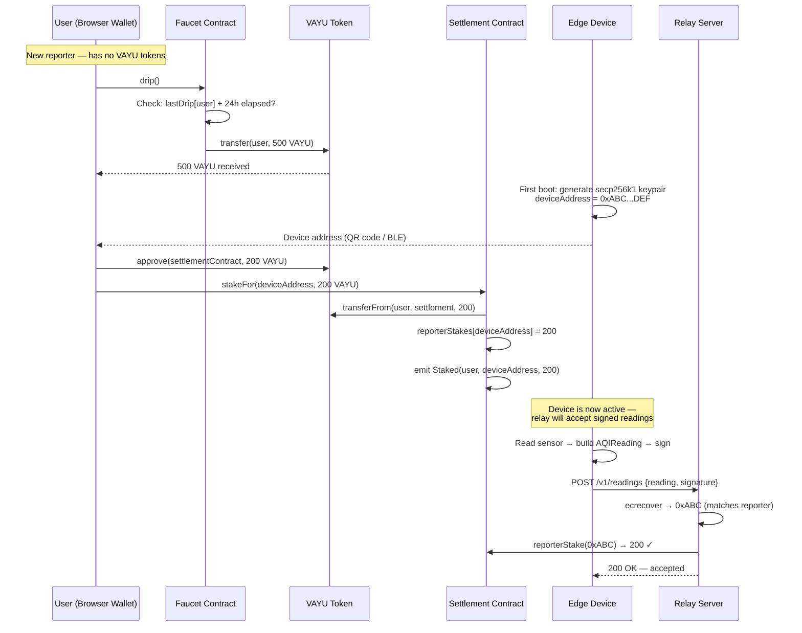
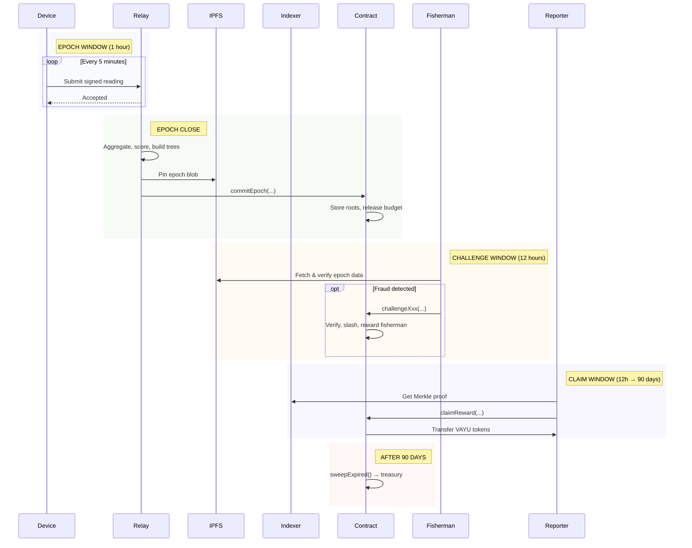

# Vayu Protocol — Sequence Diagrams

All core protocol flows. Each diagram maps directly to the interfaces
in `contracts/src/interfaces/` and the relay API in `relay/openapi.yaml`.

---

## 1. Submit Reading

Edge device submits a signed AQI reading to the relay during an epoch.

---

## 2. Epoch Commit

At the end of each epoch (1 hour), the relay aggregates readings,
computes rewards, and commits on-chain.

---

## 3a. Challenge — Spatial Anomaly

A fisherman detects that a cell's median AQI is inconsistent with its
neighbours, suggesting Sybil collusion within that cell.

---

## 3b. Challenge — Reward Computation

A fisherman detects the relay computed rewards incorrectly for a cell.

---

## 3c. Challenge — Duplicate Location

A fisherman detects a reporter submitted readings from two physically
distant cells in the same epoch (impossible without GPS spoofing).

---

## 4. Reward Claim

After the challenge window closes, a reporter claims their epoch
reward using a Merkle proof.

---

## 5. Reward Expiry & Sweep

After the 90-day claim window expires, unclaimed rewards are returned
to the protocol treasury. Anyone can trigger this.

---

## 6. Reporter Onboarding (Stake Flow)

End-to-end flow from a new user acquiring tokens to activating a device.

---

## Lifecycle Overview

How the flows connect across the full epoch lifecycle.

